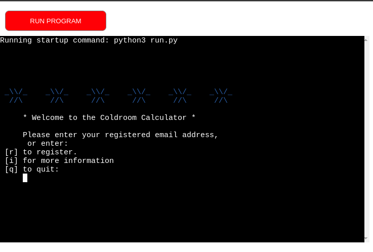
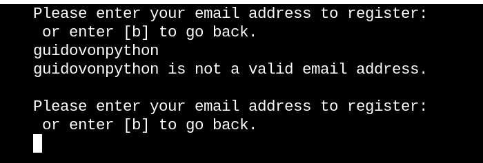
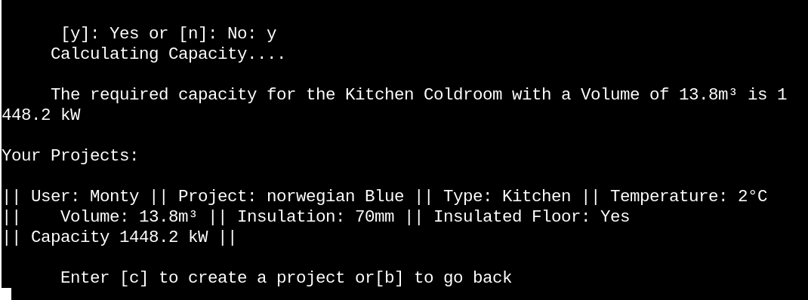
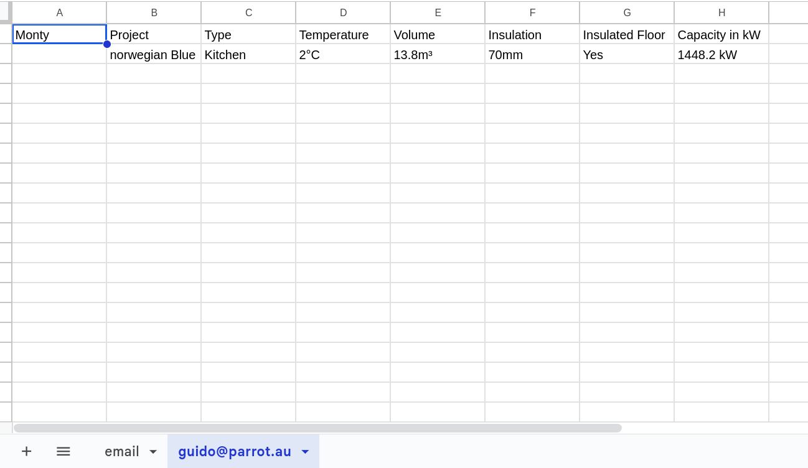
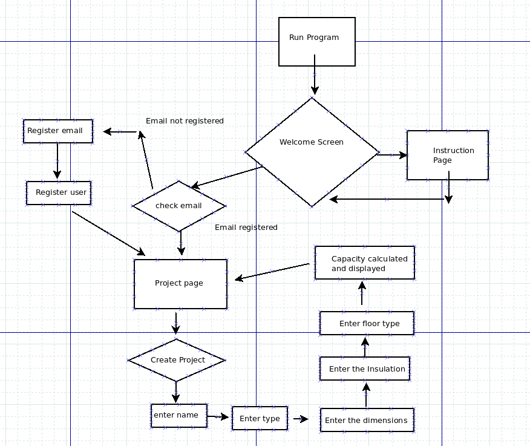
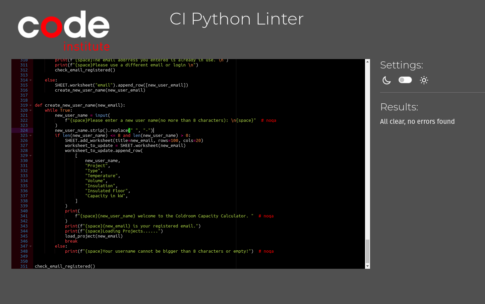
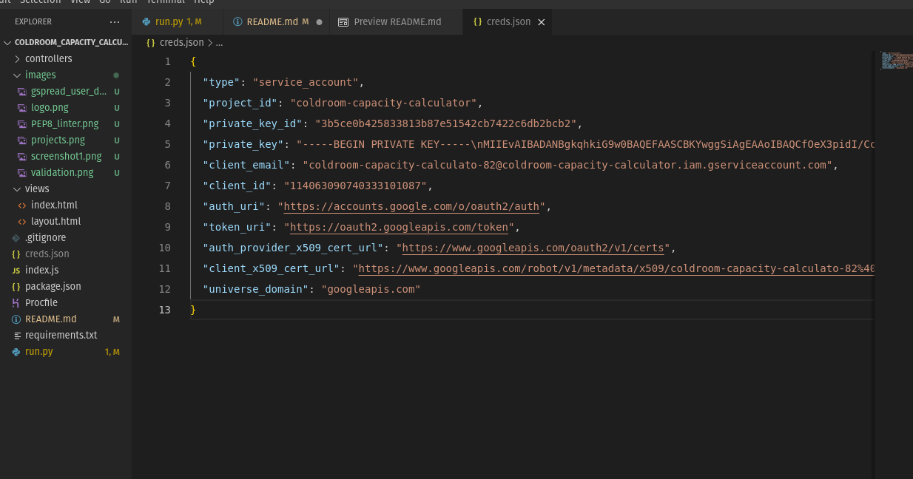
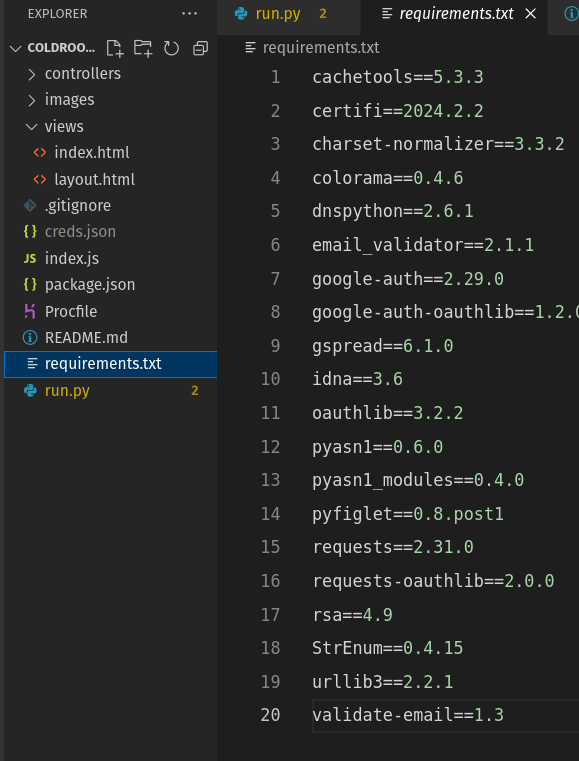

# Coldroom Capacity Calculator
The Cold Room Capacity Calculator is a Python program that calculates the capacity of a cold room based on the dimensions of the room and the type of product stored in it. The program is designed to help designers and installers of refrigeration systems determine the power/capacity of the equipment they need to install according to size and temperature of the room and,  the type of product stored in it.

Program in action (please use the full screen for better quality):

https://github.com/Drekkg/coldroom_capacity_calculator/assets/77752848/65eb34f8-12fb-453e-92f6-0db3b7743e1a

## Live Site

https://coldroom-capacity-calculator-d89eba080c21.herokuapp.com/

## Google Spreadsheet
https://docs.google.com/spreadsheets/d/1xNUrY7ALB5eUbRxFl2gEivpw_ls5vIgMhYI6hoLTZX0/edit?usp=sharing

## Repository

https://github.com/Drekkg/coldroom_capacity_calculator

## Author

Derek Garnett

## Instructions for use

On the welcome page the the user is prompted to enter their email address if they have already registered. If they have not registered they are prompted to go to the registration page. Their they will enter their email address and create a username. The program checks to see if they have enetered a valid email address. They program also checks to see if their email address is already stored in the database(gspread). If it is they are prompted to login. After they have registered their email, which is stored in the database, they must enter a valid username after which a  new spreadsheet is made with their email address and username.
They then create a new project and input the relevant information:
1.  They create a project and give it a namr.
2. They choose the desired temperature range: 
    [k] for Kitchen: 2°C suitable for all produce and meat.
    [b] for Beverages 6°C suitable for all forms of drinks.
    [d] for a Deepfreezer -18°C Long term Storage
3. Next they enter the dimensions of the coldroom in Meters.
   Height, Length and Width.
   The program calculates the volume in m³
4. The user then chooses the thickness of the insulated panels.
   Industry standard [a] 70mm or [b] 100mm(The default for a Deepfreeze)
5. Next they choose if the coldroom has an insulated floor.
   [y] or [n]
6. The program then prints out the required capacity in Kilowatts and stores 
   all the relevant information in the users spreadsheet.
7. All the users projects are then printed on the screen.
8. The user is prompted to either create another project or go back and quit the program.

## Features

### Implemented features

- Logo on "Welcome Screen" and "Project Screeen" stylized by pyfiglet

- The program has extensive input checking: 
      Email Validation
      Empty string checks
      Whitespace and lower and capital checking
      Single letter inputs are checked and validated.
      All incorrect inputs are brought to the users attention.
      The program strives to create a positive user experience.
      Where appropriate the option to go back or quit the program.
- The ability to call up and view previous calculations using an online spreadsheeet.
- No upperlimits on Coldroom size, because why not....
- Industry standard metrics.

### Entering an invalid email address.

### The projects page showing one project and one calculation

### Connected gspread datastorage showing user data

### Future Features
- More refrigeration systems: Reach-in fridges and undercounter fridges.
- A graph showing a capacity curve when outdoor temperatures are higher.

## Flow Chart

## Libraries used

- os and sys - clear screen function
- pyfiglet - ascii art (BAC Calculator logo)
- gspread - for google spreadsheets
- colorama - for better ux

## Testing

### Validation Testing

The program was validated at https://pep8ci.herokuapp.com/ and no errors were found.
There were a few lines that were too long so # noqa was added to suppress errors where line breaks would have made the code harder to read.

### User Testing
Input validation was done by various users.
All Inputs only accept valid data.
Email validation, single letter inputs only select corresponding letters, number inputs only accept number inputs.

### Defect Tracking
Many bugs were found and dealt with during development.

### Defects of Note
Getting the data to align and look halfway good on the command line was extremly challenging.
Working with google sheets was also extremely challenging

### Outstanding Defects

Spreadsheeet not found exception is not working as expected.
A future feature to be implemented

# Deployment

## Prerequisites

### Google API

Coldroom Calculator is connected with Google API.

File details:
- Document name: coldroom_capacity_calculator
- Columns A-H: Project	Type	Temperature	Volume	Insulation	Insulated Floor	Capacity in kW
- Next rows contains saved results
- Each email adrress i.e user is assigned a seperate spreadsheet

To set this up we need to:

1. install required libraries in our Python environment (pip3 install gspread google-auth) then import downloaded packages and specify the scope
2. create an excell file on our Google account
3. go to Google Cloud Platform
4. select the New Project
5. go to project created, select API & Services from the side menu, and library
6. we must enable 2 APIs - Google Drive and Google Sheets
7. to enable Google Drive API we need to create credentials
8. click Create Credentials
9. from the "Which API are you using?" dropdown menu, choose Google Drive API
10. for the "What data will you be accessing?" question, select Application Data
11. for the "Are you planning to use this API with Compute Engine, Kubernetes Engine, App Engine, or Cloud Functions?" question, select No, I'm not using them
12. click Next
13. enter a Service Account name, you can call it anything you like - I will call mine "Life of Brian" - then click Create
14. in the Role Dropdown box choose Basic > Editor then press Continue
15. these options can be left blank, click Done
16. on the next page, click on the Service Account that has been created
17. on the next page, click on the Keys tab
18. click on the Add Key dropdown and select Create New Key
19. select JSON and then click Create. This will trigger the json file with your API credentials in it to download to your machine. We must copy this file to our GitPod library and also will need this to deploy our project to Heroku

### VS Code

1. to run the program in VS Code we need to copy creds.json file:

2. install all libraries from requirements.txt (pip3 install -r requirements.txt)

3. run command "python3 run.py" in terminal

### Heroku

1. log into GitHub
2. Log into Heroku and create new app (the name of the app must be unique):

3.  On the settings tab you have to address two things:
A. **Config Vars**
  Add to vars: CRED and as value cres.json content, and second var PORT and 8000 as value
  
  

B. **Build Packs**
  In build packs add Python and Node JS
  
  

4. Deploy tab
A. Connect Heroku app with GitHub and select the correct repository:

B. Deploy either manual or automatic

## Credits
- Schiessl Refrigeration - for the Calculations
- Pyfiglet - for Logo
- os - for clear screen function
- email validator - for email validation
- colorama - for the colour(Logo)
- Google Sheets
 - Dia for flowchart

### Content
 - Code Institute - Love Sandwiches project (Google API connection instructions)
 - Stackoverflow for code explanations debugging
 - gspread documentation

 

### Acknowledgments
Malia Havlicek my Mentor.

